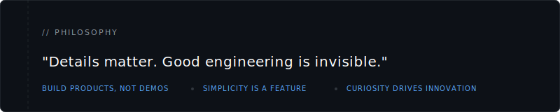
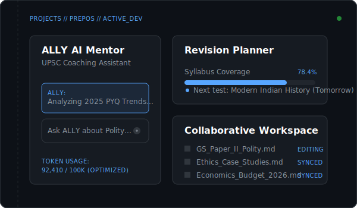
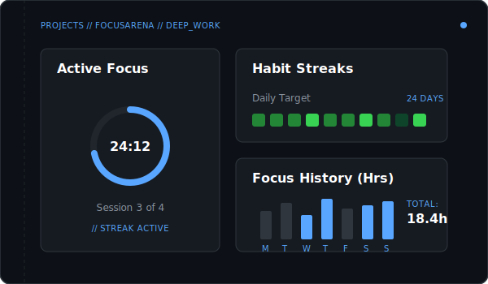
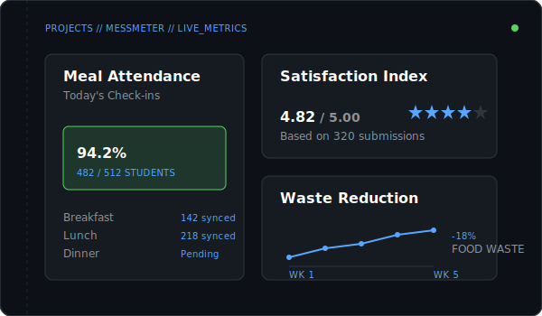
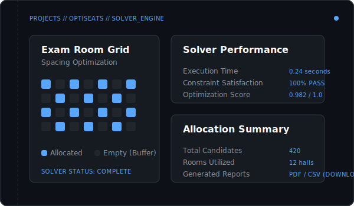
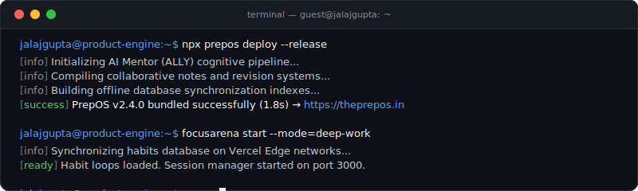

<!-- Hero Section Banner -->

  

 

<!-- Navigation and Meta Stats -->

  <a href="https://theprepos.in" target="_blank">🌐 Website</a> &nbsp;•&nbsp;
  <a href="https://linkedin.com/in/jalaj-01" target="_blank">💼 LinkedIn</a> &nbsp;•&nbsp;
  <a href="mailto:jalajgupta5550@gmail.com">✉️ Email</a> &nbsp;•&nbsp;
  <a href="https://github.com/Jalaj-01">💻 GitHub</a>
    
  <code>Followers: </code>
  &nbsp;&nbsp;
  <code>Profile Views: </code>

 

 

<!-- Section 01: Identity & Philosophy -->
<table>
  <tr>
    <td width="30%" valign="top" style="border: none;">
      <h2 style="font-family: monospace; letter-spacing: 2px; color: #8B949E; margin-top: 0;">01 // ABOUT</h2>
    </td>
    <td width="70%" valign="top" style="border: none;">
      

        I enjoy building products from scratch. I work across the entire software lifecycle—from identifying problems and designing scalable architectures to building polished user experiences and deploying production-ready systems.
      

      

        I care deeply about clean architecture, maintainable code, and creating products that people genuinely enjoy using. My interests include <strong>Artificial Intelligence</strong>, <strong>Full Stack Engineering</strong>, <strong>System Design</strong>, <strong>Developer Experience</strong>, <strong>Automation</strong>, and <strong>Product Design</strong>.
      

    </td>
  </tr>
</table>

 

  

 

 

<!-- Section 02: Dynamic Now Block -->
<table>
  <tr>
    <td width="30%" valign="top" style="border: none;">
      <h2 style="font-family: monospace; letter-spacing: 2px; color: #8B949E; margin-top: 0;">02 // NOW</h2>
      

        This section represents my live developer state. It is updated automatically via GitHub Actions.
      

    </td>
    <td width="70%" valign="top" style="border: none;">
<!-- START_SECTION:now -->
| Attribute | Current Activity / Status |
| :--- | :--- |
| 🚀 **Building** | PrepOS (optimizing AI mentor memory & UPSC analytics engine) |
| 📚 **Learning** | Advanced system design, distributed systems, and agentic workflows |
| 📖 **Reading** | Designing Data-Intensive Applications by Martin Kleppmann |
| 🎧 **Listening to** | Deep work lofi & atmospheric synth for coding sessions |
| 📅 **Last Updated** | `Jul 01, 2026 01:14 PM (IST)` |
| 🌿 **Branch** | `main` |
| 💻 **Latest Commit** | `02238d8` — *Update README.md* |
<!-- END_SECTION:now -->
    </td>
  </tr>
</table>

 

 

<!-- Section 03: Selected Work -->
<h2 style="font-family: monospace; letter-spacing: 2px; color: #8B949E; margin-bottom: 20px;">03 // SELECTED WORK</h2>

<!-- Project 1: PrepOS -->
<table width="100%">
  <tr>
    <td width="55%" valign="top" style="padding-right: 20px;">
      <h3 style="color: #ffffff; margin-top: 0;">PrepOS Flagship Product</h3>
      

        AI-powered Preparation Operating System for UPSC civil services aspirants. An integrated digital workspace that replaces fragmented tools with a unified learning architecture.
      

      <ul style="color: #C9D1D9; font-size: 13px; padding-left: 20px; line-height: 1.6;">
        <li><strong>ALLY AI Mentor</strong>: Personal cognitive coach for essay reviews &amp; syllabus query resolution.</li>
        <li><strong>Collaborative Workspace</strong>: Real-time collaborative notes, revisions, and study planners.</li>
        <li><strong>PYQ Analysis &amp; Book Library</strong>: Dynamic parsing of past year questions and organized text library.</li>
      </ul>
      

        React &nbsp;•&nbsp; Next.js &nbsp;•&nbsp; TypeScript &nbsp;•&nbsp; Node.js &nbsp;•&nbsp; MongoDB &nbsp;•&nbsp; Tailwind CSS &nbsp;•&nbsp; OpenAI APIs
      

      

        <a href="https://theprepos.in" target="_blank" style="text-decoration: none; color: #58A6FF; font-weight: bold; font-size: 13px;">🌐 Live Demo</a> &nbsp;&nbsp;&nbsp;&nbsp;
        <a href="https://github.com/Jalaj-01/prepos" target="_blank" style="text-decoration: none; color: #8B949E; font-size: 13px;">💻 Repository</a>
      

    </td>
    <td width="45%" valign="middle" align="center">
      
    </td>
  </tr>
</table>

 

 

<!-- Project 2: FocusArena -->
<table width="100%">
  <tr>
    <td width="45%" valign="middle" align="center">
      
    </td>
    <td width="55%" valign="top" style="padding-left: 20px;">
      <h3 style="color: #ffffff; margin-top: 0;">FocusArena Production Ready</h3>
      

        Productivity platform tailored for deep work sessions, streak logging, and habit consistency. Helps engineers minimize context switching and measure high-focus outputs.
      

      <ul style="color: #C9D1D9; font-size: 13px; padding-left: 20px; line-height: 1.6;">
        <li><strong>Deep Work Sessions</strong>: Automated session block tracking with built-in timers.</li>
        <li><strong>Habit Architect</strong>: Daily consistency streaks and progression calendars.</li>
        <li><strong>Edge-Synced Analytics</strong>: Super-fast synchronization across user platforms.</li>
      </ul>
      

        React &nbsp;•&nbsp; TypeScript &nbsp;•&nbsp; Firebase Auth &nbsp;•&nbsp; Firestore &nbsp;•&nbsp; Tailwind CSS &nbsp;•&nbsp; Vercel
      

      

        <a href="https://focusarena-pi.vercel.app/" target="_blank" style="text-decoration: none; color: #58A6FF; font-weight: bold; font-size: 13px;">🌐 Live Demo</a>
      

    </td>
  </tr>
</table>

 

 

<!-- Project 3: MessMeter -->
<table width="100%">
  <tr>
    <td width="55%" valign="top" style="padding-right: 20px;">
      <h3 style="color: #ffffff; margin-top: 0;">MessMeter Institutional Launch</h3>
      

        Institutional meal attendance, menu management, and food feedback platform. Designed to eliminate food waste and automate attendance logging in university dining halls.
      

      <ul style="color: #C9D1D9; font-size: 13px; padding-left: 20px; line-height: 1.6;">
        <li><strong>Real-time QR Logging</strong>: Fast, touchless attendance registration at mess entry.</li>
        <li><strong>Feedback Analytics</strong>: Daily reviews dashboard allowing menu adjustments based on satisfaction.</li>
        <li><strong>Waste Optimization</strong>: Visual tracking of food consumption vs. preparation metrics.</li>
      </ul>
      

        TypeScript &nbsp;•&nbsp; Node.js &nbsp;•&nbsp; Express.js &nbsp;•&nbsp; Firebase Database &nbsp;•&nbsp; ChartJS &nbsp;•&nbsp; HTML5 / CSS3
      

      

        <a href="https://mess-feedback-system-d94a5.web.app/" target="_blank" style="text-decoration: none; color: #58A6FF; font-weight: bold; font-size: 13px;">🌐 Live Demo</a> &nbsp;&nbsp;&nbsp;&nbsp;
        <a href="https://github.com/Jalaj-01/MessMeter" target="_blank" style="text-decoration: none; color: #8B949E; font-size: 13px;">💻 Repository</a>
      

    </td>
    <td width="45%" valign="middle" align="center">
      
    </td>
  </tr>
</table>

 

 

<!-- Project 4: OptiSeats -->
<table width="100%">
  <tr>
    <td width="45%" valign="middle" align="center">
      
    </td>
    <td width="55%" valign="top" style="padding-left: 20px;">
      <h3 style="color: #ffffff; margin-top: 0;">OptiSeats Utility Tool</h3>
      

        Automated exam seating allocation platform generating optimized seating arrangements while preventing exam misconduct by dispersing students across rooms according to strict constraints.
      

      <ul style="color: #C9D1D9; font-size: 13px; padding-left: 20px; line-height: 1.6;">
        <li><strong>Heuristic Solver</strong>: Instantly maps hundreds of candidates across room matrices in seconds.</li>
        <li><strong>Cheat Minimization</strong>: Guarantees buffer spaces and alternates department codes.</li>
        <li><strong>Export Suite</strong>: Instant downloads for PDFs, seat lists, and room charts.</li>
      </ul>
      

        Python &nbsp;•&nbsp; Streamlit &nbsp;•&nbsp; Pandas &nbsp;•&nbsp; ReportLab &nbsp;•&nbsp; NumPy
      

      

        <a href="https://optiseat.streamlit.app/" target="_blank" style="text-decoration: none; color: #58A6FF; font-weight: bold; font-size: 13px;">🌐 Live Demo</a> &nbsp;&nbsp;&nbsp;&nbsp;
        <a href="https://github.com/Jalaj-01/OptiSeats" target="_blank" style="text-decoration: none; color: #8B949E; font-size: 13px;">💻 Repository</a>
      

    </td>
  </tr>
</table>

 

 

<!-- Other Projects Section -->
<table>
  <tr>
    <td width="30%" valign="top" style="border: none;">
      <h3 style="font-family: monospace; letter-spacing: 2px; color: #8B949E; margin-top: 0;">ADDITIONAL WORK</h3>
      

        Research implementations, full-stack marketplace systems, and student utility portals.
      

    </td>
    <td width="70%" valign="top" style="border: none;">
      
      <!-- FactoDual-X -->
      

        <strong style="color: #ffffff;">FactoDual-X</strong> &nbsp;•&nbsp; Python // PyTorch // Transformers
        

          Hyperspectral image classification using a dual-branch Transformer architecture. Implements cross-modal attention blocks to fuse spatial-spectral features, achieving state-of-the-art token representations.
        

        
<a href="https://github.com/Jalaj-01/FactoDual-X" style="text-decoration: none; color: #58A6FF; font-size: 12px;">💻 Repository</a>

      

      <!-- Sitezy -->
      

        <strong style="color: #ffffff;">Sitezy</strong> &nbsp;•&nbsp; React // Next.js // Node.js // Express // MongoDB
        

          Full-stack marketplace platform built with OTP phone authentication, Google OAuth integration, secure Razorpay checkout gateway APIs, and a comprehensive administration dashboard.
        

      

      <!-- Sarthi -->
      

        <strong style="color: #ffffff;">Sarthi</strong> &nbsp;•&nbsp; Node.js // Express // Socket.IO // Docker
        

          Real-time collaborative campus messaging platform. Features role-based access control, socket-based message broadcasting, Dockerized deployment scripts, and OAuth integrations.
        

      

      <!-- Buddy -->
      

        <strong style="color: #ffffff;">Buddy</strong> &nbsp;•&nbsp; Angular // Java // Spring Boot // MySQL
        

          Full-stack examination and student evaluation portal. Implements Spring Security role mappings, test timer validations, and detailed performance report exports.
        

      

    </td>
  </tr>
</table>

 

 

<!-- Section 04: Terminal build visualization -->
<table>
  <tr>
    <td width="30%" valign="top" style="border: none;">
      <h2 style="font-family: monospace; letter-spacing: 2px; color: #8B949E; margin-top: 0;">04 // DX</h2>
      

        Active development build traces and compilation cycles.
      

    </td>
    <td width="70%" valign="top" style="border: none;">
      

        
      

    </td>
  </tr>
</table>

 

 

<!-- Section 05: Skill Matrix -->
<table>
  <tr>
    <td width="30%" valign="top" style="border: none;">
      <h2 style="font-family: monospace; letter-spacing: 2px; color: #8B949E; margin-top: 0;">05 // TOOLBOX</h2>
      

        Core programming languages, frameworks, AI stacks, and devops infrastructure.
      

    </td>
    <td width="70%" valign="top" style="border: none;">
      <table width="100%">
        <tr>
          <td valign="top" width="50%" style="border: none; padding-bottom: 15px;">
            <strong style="color: #ffffff; font-size: 13px; font-family: monospace;">LANGUAGES</strong>  
            
          </td>
          <td valign="top" width="50%" style="border: none; padding-bottom: 15px;">
            <strong style="color: #ffffff; font-size: 13px; font-family: monospace;">FRONTEND</strong>  
            
          </td>
        </tr>
        <tr>
          <td valign="top" width="50%" style="border: none; padding-bottom: 15px;">
            <strong style="color: #ffffff; font-size: 13px; font-family: monospace;">BACKEND &amp; DATABASE</strong>  
            
          </td>
          <td valign="top" width="50%" style="border: none; padding-bottom: 15px;">
            <strong style="color: #ffffff; font-size: 13px; font-family: monospace;">AI &amp; MACHINE LEARNING</strong>  
            
          </td>
        </tr>
        <tr>
          <td valign="top" width="100%" colspan="2" style="border: none;">
            <strong style="color: #ffffff; font-size: 13px; font-family: monospace;">TOOLS &amp; CLOUD INFRASTRUCTURE</strong>  
            
          </td>
        </tr>
      </table>
    </td>
  </tr>
</table>

 

 

<!-- Section 06: Analytics -->
<table>
  <tr>
    <td width="30%" valign="top" style="border: none;">
      <h2 style="font-family: monospace; letter-spacing: 2px; color: #8B949E; margin-top: 0;">06 // METRICS</h2>
      

        Language distributions, repository statistics, and annual activity paths.
      

    </td>
    <td width="70%" valign="top" style="border: none;">
      

        <!-- Main Stats Card (GitHub Readme Stats Transparent) -->
        
        &nbsp;&nbsp;
        <!-- Generated Language Metrics via Workflow -->
        
      

        
      <!-- Generated Snake Game contributions -->
      

        <strong style="color: #ffffff; font-size: 12px; font-family: monospace; display: block; margin-bottom: 8px;">CONTRIBUTION DRIFT</strong>
        
      

    </td>
  </tr>
</table>

 

 

<!-- Footer -->

  
// Craftsmanship is a habit. Built with intention.

  
&copy; 2026 Jalaj Gupta. All systems nominal.

